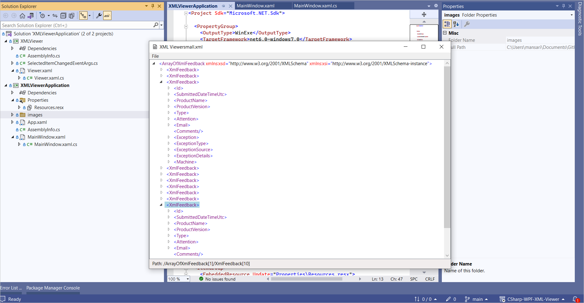

# CSharp-WPF-XML-Viewer
A C# project for exploring XML files. 

## How to run?

This program developed under Visual Studio Community 2022, with .NET 6 standards. Just pull the project and open the `XMLViewerApplication.sln` file. 

